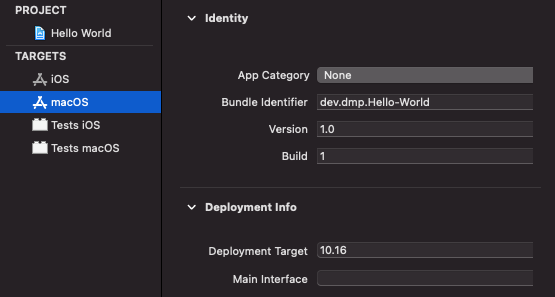
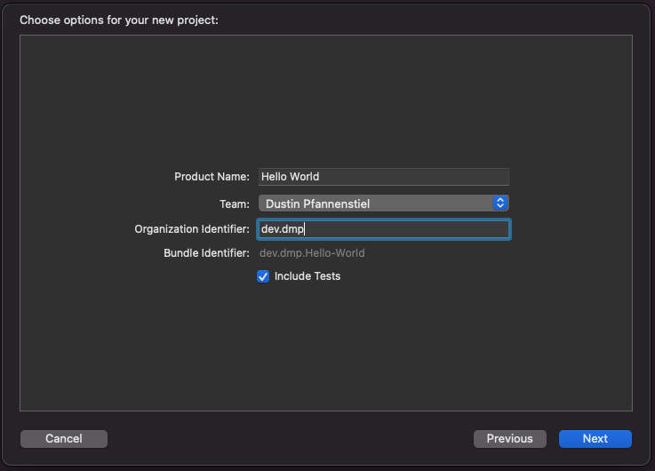

#  Hello World

The traditional greeting of my people.

This "Hello World" program has three significant things of note.

The first is that it is a multiplatform application.  A single `@main` Application is expected to run on both macOS and iOS.  In and of itself that's not too interesting.  This is the expected behavior of a multiplatform app. What I did find interesting is that the target of the macOS application was version 10.16.

macOS Big Sur was listed as version 11 in the Keynote and all marketing material, but it's being shown still as 10.16.  I guess that shows how recently the decision was made to change it to macOS 11.

Second was how easy it was to get tests working.  They're still seperated by platform, but all the APIs still work.  I've added tests that search for static text.  Everything seems fine.  It's probably the only time I'll every get 100% test coverage.  They ran perfectly on both mac and iPhone.

I do find it a little interesting that they still lump iOS and iPadOS together in the run list.  It made me wonder if macOS is true macOS or if it's macCatalyst. And checking the target for iOS, sure enough the check box for "mac" was still there.  That certainly implies this Mac target is a full macOS app, not MacCatalyst.

Finally there are fewer options when setting up a new project.

I understand why there are no options for Storyboard versus SwiftUI in a multiplatform project.  But typically I'd expect there to be an option for both UITests and UnitTests.  Also, there's no boiler plate for CoreData.  I'll need to see if this is just for multiplatform, it's happened before, or represents a larger change in Xcode.
